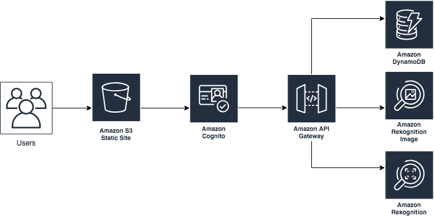

## Riconoscimento delle emozioni facciali in tempo reale mediante una videocamera ##

Trattasi di un'applicazione web in grado di riconoscere le emozioni facciali in tempo reale mediante una videocamera e calcolare il livello di coinvoilgimento del pubblico. Inoltre, include la possibilità di riconoscere i volti delle persone precedentemente registrate.

### Architecture

L'applicazione usa l'API Amazon Rekogntion Video [Amazon Rekognition](https://aws.amazon.com/rekognition) per le immagini e la sentiment analisi, [Amazon DynamoDB](https://aws.amazon.com/dynamodb) per lo storage, [Amazon API Gateway](https://aws.amazon.com/api-gateway) e [Amazon Cognito](https://aws.amazon.com/cognito) per le API, e [Amazon S3](https://aws.amazon.com/s3), [AWS Amplify](https://aws.amazon.com/amplify), e [React](https://reactjs.org) per il deployment front-end.

Esistono tre flussi principali:
(A): flusso **"add user"** (A) viene attivato cliccando sul relativo pulsante dell’interfaccia;
(B): flusso di "riconoscimento degli utenti aggiunti”, visualizza **"added users recognition"**
C: flusso di **"sentiment analysis"** 
B e C si attivano cliccando sul pulsante *"Start Rekognition"* e il ciclo si interrompe con il pulsante *"Stop Rekognition"*

### Utilizzo

#### Prerequisiti

Per distribuire l'applicazione di esempio è necessario un account AWS. Per creane uno <https://aws.amazon.com> seguendo le istruzioni sullo schermo. 
L'accesso all'account AWS necessita di autorizzazioni IAM per avviare i modelli AWS CloudFormation che creano ruoli IAM.

Occorre un browser aggiornato -verifica su [modern browser](https://caniuse.com/#feat=stream) e una webcam (anche integrata).

#### Deployment

Il deployment della demo avviene con [AWS CloudFormation](https://aws.amazon.com/cloudformation) templace.

> **Nota bene**  
I servizi AWS utilizzati hanno un costo durante l'esecuzione di questo progetto. 
Per i dettagli completi, consulta le pagine dei prezzi per ciascun servizio AWS che utilizzerai. I prezzi sono soggetti a variazioni.

1. Deployment tramite il templace CloudFormation seguendo uno dei seguenti link in base alla regione AWS:

|Region|Launch Template|
|------|---------------|
|**US East (N. Virginia)** (us-east-1) | |
|**US East (Ohio)** (us-east-2) | |
|**US West (Oregon)** (us-west-2) | |
|**Asia Pacific (Seoul)** (ap-northeast-2) | |
|**Asia Pacific (Sydney)** (ap-southeast-2) | |
|**Asia Pacific (Tokyo)** (ap-northeast-1) | |
|**EU (Ireland)** (eu-west-1) | |

2. Accedere all'account AWS seguendo le istruzioni.
a. Dovresti vedere una schermata intitolata "* Crea Stack *" al passaggio "* Specifica modello *". I campi che specificano il modello CloudFormation sono precompilati. Fai clic sul pulsante * Avanti * nella parte inferiore della pagina.
b. Nella schermata "* Specifica i dettagli dello stack *" è possibile personalizzare i seguenti parametri dello stack CloudFormation:
   * ** Nome stack: ** (impostazione predefinita: EngagementMeter) Questo è il nome utilizzato per fare riferimento a questo stack in CloudFormation una volta distribuito. Il valore deve essere di 15 caratteri o meno.
   * ** CollectionId: ** (impostazione predefinita: RekogDemo) Le risorse AWS sono denominate in base al valore di questo parametro. È necessario personalizzarlo se si avvia più di un'istanza dello stack nello stesso account.
   * ** CreateCloudFrontDistribution ** (impostazione predefinita: false) Crea una distribuzione CloudFront per accedere all'interfaccia Web della demo. Questo deve essere abilitato se S3 Block Public Access è abilitato a livello di account. ** Nota: ** La creazione di una distribuzione CloudFront può aumentare significativamente il tempo di distribuzione (da circa 5 minuti a oltre 30 minuti)

   Quando ha completato la procedura, prosegui per [Configura opzioni stack] (https://docs.aws.amazon.com/AWSCloudFormation/latest/UserGuide/cfn-console-add-tags.html), quindi fai clic su * Avanti *.
1. Nella schermata di revisione, è necessario selezionare le caselle per:
   * "* Riconosco che AWS CloudFormation potrebbe creare risorse IAM *"
   * "* Riconosco che AWS CloudFormation potrebbe creare risorse IAM con nomi personalizzati * 

   These are required to allow CloudFormation to create a Role to allow access to resources needed by the stack and name the resources in a dynamic way.
1. Click *Create Change Set* 
1. On the *Change Set* screen, click *Execute* to launch your stack.
   * You may need to wait for the *Execution status* of the change set to become "*AVAILABLE*" before the "*Execute*" button becomes available.
1. Wait for the CloudFormation stack to launch. Completion is indicated when the "Stack status" is "*CREATE_COMPLETE*".
   * You can monitor the stack creation progress in the "Events" tab.
1. Note the *url* displayed in the *Outputs* tab for the stack. This is used to access the application.

#### Accessing the Application

Si accede all'applicazione utilizzando un browser Web. L'indirizzo è l'output * url * dallo stack CloudFormation creato durante i passaggi di distribuzione.

* Quando si accede all'applicazione, il browser chiederà l'autorizzazione per l'uso della videocamera. Dovrai fare clic su "* Consenti *" affinché l'applicazione funzioni.
* Fai clic su "* Aggiungi un nuovo utente *" se desideri aggiungere nuovi profili.
* Fai clic su "* Avvia rekognition *" per avviare il motore. L'app inizierà a visualizzare informazioni sui volti riconosciuti e calibrerà lo strumento.

### Rimozione dell'applicazione

Per rimuovere l'applicazione, apri AWS CloudFormation Console, fai clic sul progetto, poi "* Elimina stack *". 

### Apportare modifiche al codice e personalizzazione

Il file [contributing guidelines](CONTRIBUTING.md) contiene istruzioni su come eseguire localmente il front-end e apportare modifiche allo stack di back-end.

## Contributi

I contributi sono graditi secondo il [code of conduct](CODE_OF_CONDUCT.md) e le guidelinea [contributing guidelines](CONTRIBUTING.md).

## Licenza

Questo codice è valido con licenza MIT license. Vedere file License
